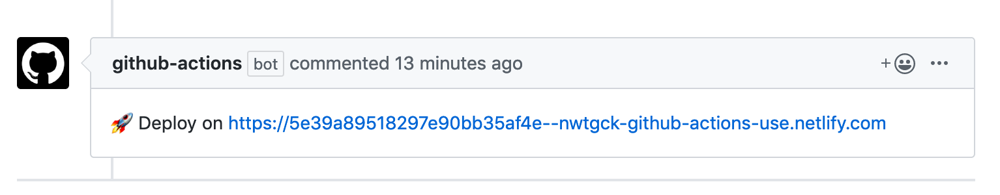
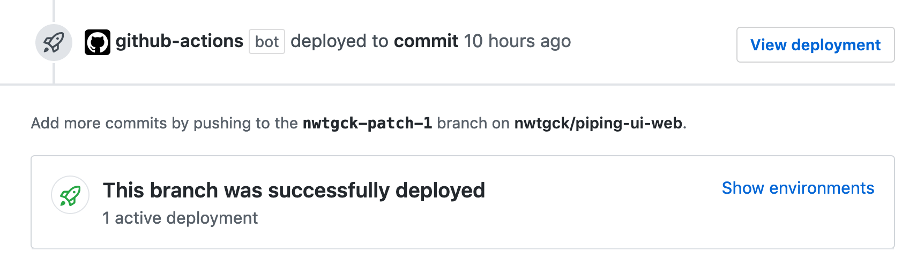

# actions-netlify


GitHub Actions for deploying to Netlify



Deploy URLs are commented on your pull requests and commit comments!



GitHub Deployments are also supported!

## Usage

```yaml
# .github/workflows/netlify.yml
name: Build and Deploy to Netlify
on:
  push:
  pull_request:
    types: [opened, synchronize]
jobs:
  build:
    runs-on: ubuntu-18.04
    steps:
      - uses: actions/checkout@v2

      # ( Build to ./dist or other directory... )

      - name: Deploy to Netlify
        uses: nwtgck/actions-netlify@v1.1
        with:
          publish-dir: './dist'
          production-branch: master
          github-token: ${{ secrets.GITHUB_TOKEN }}
          deploy-message: "Deploy from GitHub Actions"
          enable-pull-request-comment: false
          enable-commit-comment: true
          overwrites-pull-request-comment: true
        env:
          NETLIFY_AUTH_TOKEN: ${{ secrets.NETLIFY_AUTH_TOKEN }}
          NETLIFY_SITE_ID: ${{ secrets.NETLIFY_SITE_ID }}
        timeout-minutes: 1
```


### Required inputs and env
- `publish-dir` (e.g. "dist", "_site")
- `NETLIFY_AUTH_TOKEN`: [Personal access tokens](https://app.netlify.com/user/applications#personal-access-tokens) > New access token
- `NETLIFY_SITE_ID`: team page > your site > Settings > Site details > Site information > API ID 
  - NOTE: API ID is `NETLIFY_SITE_ID`.

### Optional inputs
- `production-branch` (e.g. "master")
- `production-deploy`: Deploy as Netlify production deploy (default: false)
- `github-token: ${{ secrets.GITHUB_TOKEN }}`
- `deploy-message` A custom deploy message to see on Netlify deployment (e.g. `${{ github.event.pull_request.title }}`)
- `enable-pull-request-comment: true` Comment on pull request (default: true)
- `enable-commit-comment: true` Comment on GitHub commit (default: true)
- `overwrites-pull-request-comment: true` Overwrites comment on pull request (default: true)
- `netlify-config-path: ./netlify.toml` Path to `netlify.toml` (default: undefined)
- `functions-dir` Netlify functions output directory (default: undefined)
- `alias` Specifies the prefix for the deployment URL (default: Netlify build ID)
  - `alias: ${{ github.head_ref }}` replicates the [branch deploy prefix](https://docs.netlify.com/site-deploys/overview/#definitions)
  - `alias: deploy-preview-${{ github.event.number }}` replicates the [deploy preview prefix](https://docs.netlify.com/site-deploys/overview/#definitions)
- `github-deployment-environment` Environment name of GitHub Deployments

### Paths are relative to the project's root
All paths (eg, `publish-dir`, `netlify-config-path`, `functions-dir`) are relative to the project's root or absolute paths.

### Outputs
- `deploy-url` A deployment URL generated by Netlify

## Build on local

```bash
npm ci
npm run all
```
